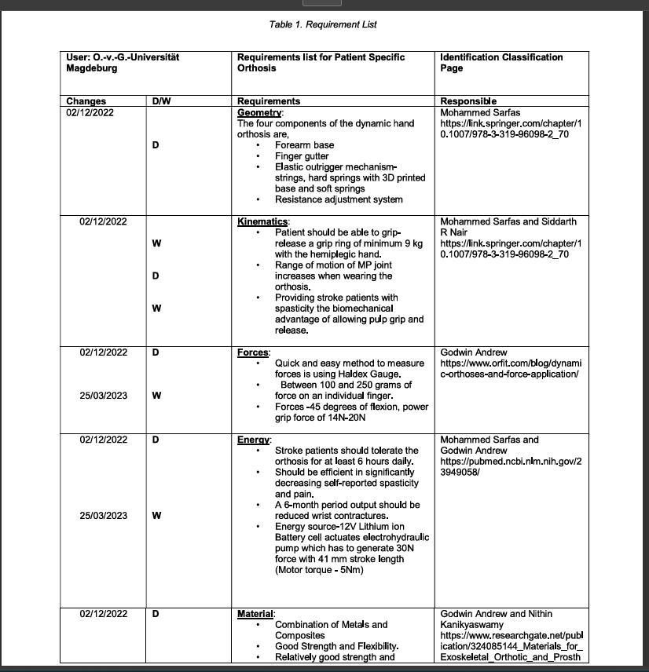
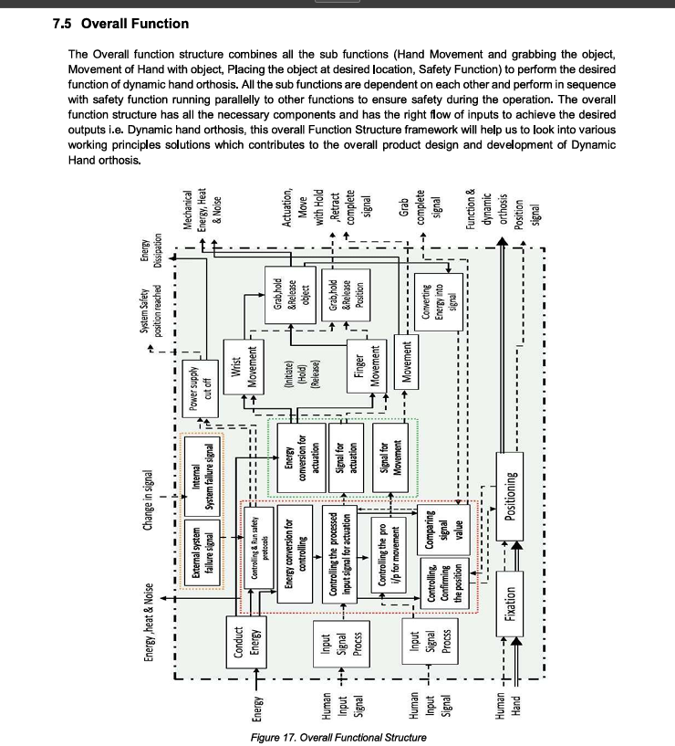
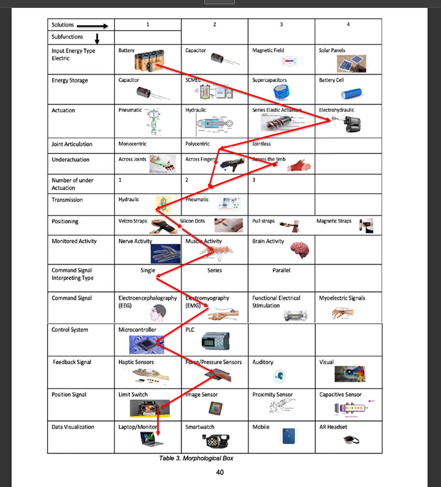

# Patient-Specific Hand Orthosis – Engineering Design Project

  
  
  
  

**One-liner:** Engineering design of a patient-specific hand orthosis — requirements analysis, functional structure, and evaluation of concept alternatives.

---

## ⭐ STAR Summary

**Situation**  
Design of a patient-specific hand orthosis required balancing functional needs, ergonomics, and safety while ensuring systematic engineering documentation.  

**Task**  
Develop a structured concept that fulfills all requirements, provides a clear functional breakdown, and is validated through systematic evaluation.  

**Action**  
- Compiled a consolidated **requirements list** covering functional & non-functional needs.  
- Developed the **functional structure** to map overall functions and safety aspects.  
- Applied a **concept evaluation matrix** to compare design alternatives and select the optimal solution.  

**Result**  
- Delivered a **validated concept** aligned with stakeholder requirements.  
- Ensured structured traceability from needs → functions → concept.  
- Provided engineering justification through transparent evaluation criteria.  

---

## 📑 Key Artefacts

  
   
  <em>🏗️ Figure 1: Requirements list (excerpt) — consolidated functional and non-functional needs for the hand orthosis.</em>

  
   
  <em>🔄 Figure 2: Functional structure — overall function chain for actuation, grip, placement, and safety.</em>

  
   
  <em>✅ Figure 3: Concept evaluation matrix — comparison of design alternatives with scoring based on key criteria.</em>

---

## 📄 Full Report (PDF)

- [📥 Download: Hand Orthosis – Engineering Design Report (PDF)](docs/reports/HandOrthosis_Final.pdf)

---

## 📂 Repository Structure

